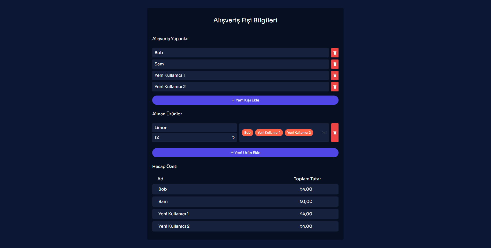
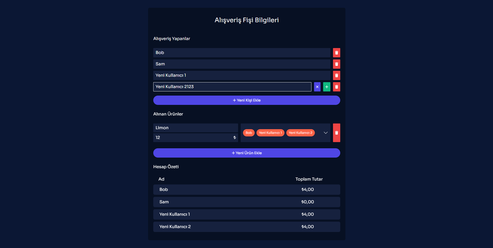

# receipt-splitter

  This project calculate the total price in a shopping receipt separately, according to the products purchased by the people then shows them.

## Live
### **[Preview on Netlify](https://receipt-spliiter.netlify.app/)**
<br >

## Project Setup

```sh
npm install
```

### Compile and Hot-Reload for Development

```sh
npm run dev
```

### Compile and Minify for Production

```sh
npm run build
```

# Screenshots



<p align="center">
  
</p>
